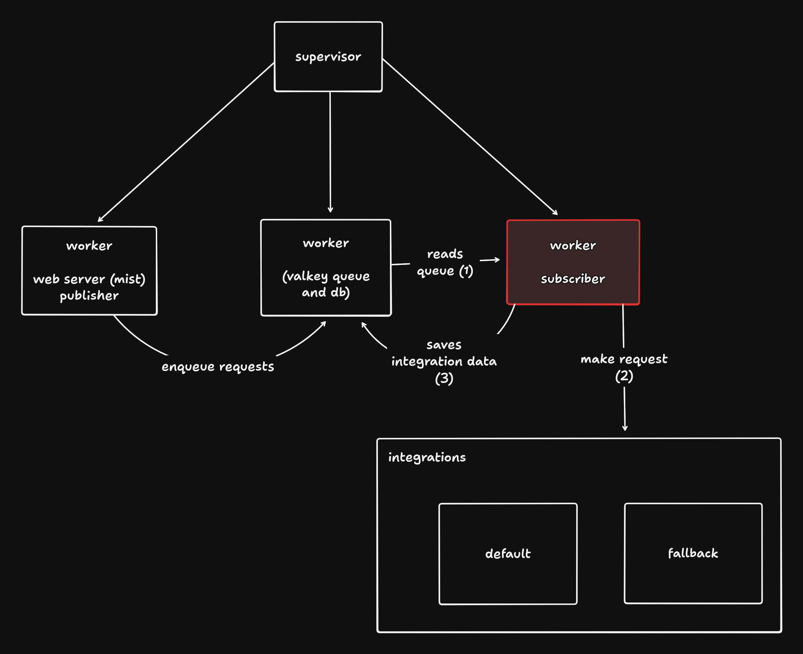

# Rinha de backend 2025

Codigo da minha aplicacao em Gleam para a [terceira edição da Rinha de Back-end](https://github.com/zanfranceschi/rinha-de-backend-2025) do @zanfranceschi.

Esta foi uma tentativa de aprender a utilizar Gleam em um ambiente mais proximo ao comercial e
tambem de realizar a implementacao utilizando o OTP da VM do Erlang

## Tecnologias

- Gleam (language)
- Valkey (storage and queue engine)
- Nginx (load balancer)

## Arquitetura dos supervisores

## Melhorias

- Usar mais processadores client para consumir a fila
- Utilizar o ETS e remover o Valkey (fazendo a solucao utilizar somente a VM do erlang) (as libs para utilizar o ETS no Gleam estao com a versao do gleam_erlang incompativeis com a versao utilizada no projeto)
